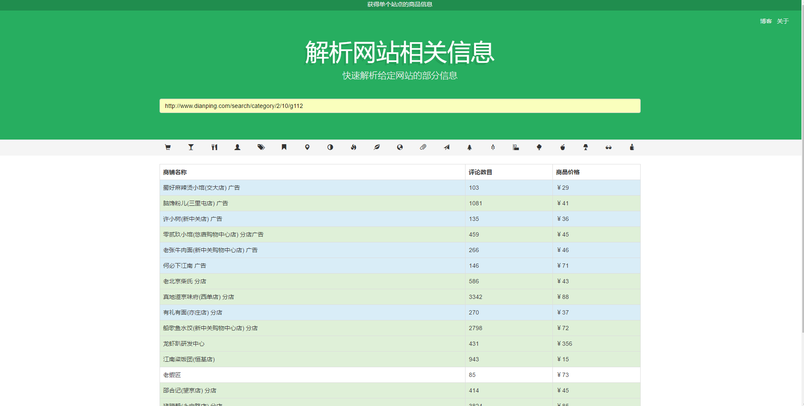

# CrawlWebsite 
  [![NPM Version][npm-image]][npm-url] 
  [![Windows Build][appveyor-image]][appveyor-url]

According to crawl a special website，we can,undoubtedly , get good date that is benefits for analysing the tendency of different shops.Dianping‘s website currently is the target of this project，which is programmed by nodejs、express、jada and boostrap.

## Installation
* Source code installation
* install the program with docker
## Quick Start

[npm-image]: https://img.shields.io/npm/v/express.svg
[npm-url]: https://npmjs.org/package/express
[appveyor-image]: https://img.shields.io/appveyor/ci/dougwilson/express/master.svg?label=windows
[appveyor-url]: https://ci.appveyor.com/project/dougwilson/express
